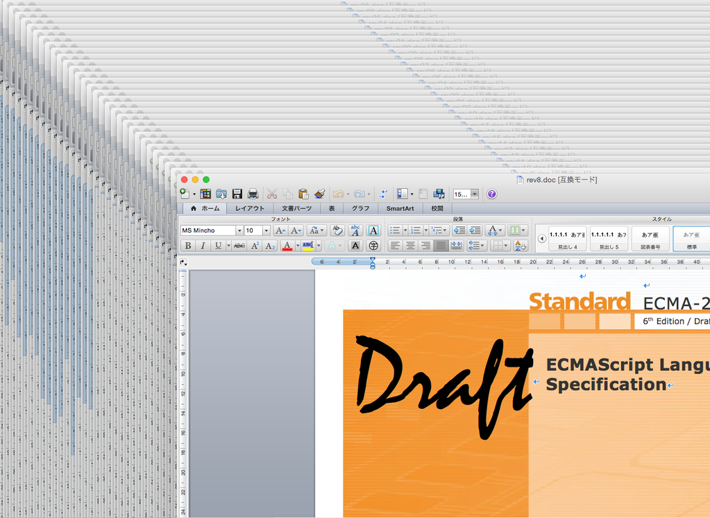

# 自己紹介


- Name : **azu**
- Twitter : @[azu_re](https://twitter.com/azu_re)
- Website: [Web scratch], [JSer.info]

[Web scratch]: http://efcl.info/ "Web scratch"
[JSer.info]: http://jser.info/ "JSer.info"

----

# ECMAScriptとは?

- [Ecma International](http://www.ecma-international.org/default.htm "Ecma International")によって標準化されてるJavaScriptの仕様の事
- 仕様: ECMAScript
- 実装: JavaScript
- Stableな最新版はECMAScript 2015(aka. ES6)

------

# ECMA-262

- ECMAScriptの事
- _262_はEcma Internationalでの管理番号
- [Ecma Standards - list](http://www.ecma-international.org/publications/standards/Standard.htm "Ecma Standards - list")


------

# TC39

- Technical Committee = 専門委員会
- [TC39](http://www.ecma-international.org/memento/TC39.htm): ECMAScriptを策定してる専門委員会のこと
- Ecmaは色々な仕様を策定しているので、その中でECMAScriptを策定してるグループの名前がTC39
- ちなみに同じくEcma標準化されてるDartは[TC52](http://www.ecma-international.org/memento/TC52.htm)

------

# ECMAScript 6 / 2015の呼び方

- 一応の正式名称はECMAScript 2015。通称はES6
- ES6から1年毎にリリースしていく予定のため、2015, 2016…となるように変更された

> ES2015が正式名称であり、来年以降のECMAScriptの策定やリリースのスタイルに名称を合わせるというのが理由

- [ES6 or ES2015 ?](http://blog.cybozu.io/entry/9081 "ES6 or ES2015 ? 〜WEB+DB PRESS Vol.87 ES6特集に寄せて〜 - Cybozu Inside Out | サイボウズエンジニアのブログ")

-----

## ES6のエディタ

[](https://twitter.com/awbjs "Allen Wirfs-Brock (@awbjs) | Twitter")

- Allen Wirfs-Brock(アレン・ワーフスブラック) @ <del>Mozilla</del> [family business](https://twitter.com/awbjs/status/649995551467945984)
- [@awbjs](https://twitter.com/awbjs "@awbjs")

------

# Ecma標準とISO標準の違い

- ECMAScriptは
    - デファクト標準([Ecma International](http://www.ecma-international.org/default.htm "Ecma International")により標準化)
    - デジュール標準(ISO標準化 [ISO/IEC 16262](http://www.iso.org/iso/iso_catalogue/catalogue_tc/catalogue_detail.htm?csnumber=55755 "ISO/IEC 16262"))
- 2つの標準化されたものを持ってるけどデファクトの方しか基本見てない
- 日本ではISO/IEC JTC1/SC22のECMAScript Adhoc委員会[@azu](https://github.com/azu)もレビュアとして参加


------

# ECMAScript 7 / 2016

- 大抵の場合は次(ES6の次)のECMAScriptの事
- 「ES7のDecoratorについて」といった言い方はまだ仕様に入ることすら決まってないので話半分
- 「次期ECMAScriptに提案されているDecoratorについて」というのがより正確
- 次期ECMAScriptの事をECMAScript nextとかES.nextと言ったりもする

------

# ES.nextのエディタ

[](https://twitter.com/bterlson)

- Brian Terlson(ブライアン・テルソン) @ Microsoft
- [@bterlson](https://twitter.com/bterlson "@bterlson")

------

# ES.nextと策定プロセス

- ECMAScript 2016からは機能ごとに仕様のプロポーザル(提案)を出し策定
- それぞれのプロポーザルには**Stage**と呼ばれる5段階のラベルがある
- 1年ごとに新しいECMAScript仕様がリリースされる
- Stage 4となったプロポーザルは次期ECMAScriptに取り込まれ、正式にECMAScriptの仕様となる

------

## 5段階のStage

- 0 Strawman - アイデア
- 1 Proposal - 提案
- 2 Draft    - ドラフト
- 3 Candidate- 仕様書と同じ形式
- 4 Finished - 策定完了

次期ECMAScriptは1年ごとに出るので、その時までにStage 4となったものが次期ECMAScriptに入る。

----

# TC39 Process: Stage

詳しくは[The TC39 Process](https://tc39.github.io/process-document/ "The TC39 Process")を読む。
Stageは条件を満たすと1つずつアップする

- Stage 0: Strawman
    - アイデア
- Stage 1: Proposal
    - プロポーザルの目的や解決方法を示す
    - Polyfillやデモ等を用いて解説する
- Stage 2: Draft
    - いわゆるドラフト
    - ECMAScript標準と同じルールでAPIや構文、セマンティックについて説明していなければならない
- Stage 3: Candidate
    - 仕様は完成した状態
    - 実装や外部のフィードバックを求める状態
    - レビュアはその仕様策定者以外ならだれでもなれるが専門的な知識を持っている必要がある
    - ECMAScriptのエディタがチェックする必要があり 
- Stage 4: Finished
    - 2つの実装(not Polyfill)が必要
    - ECMAScriptへ取り込まれる準備が完了したことを示す状態
    - ECMAScriptのエディタがチェックする必要があり

------

## 例) do式


- [do式が実装された - JS.next](http://js-next.hatenablog.com/entry/2015/10/23/193955 "do式が実装された - JS.next")
- 今の時点でStage 0なのでES7で入ることはほぼない

-----

## ブラウザに実装 ≠ 仕様に入る

- ブラウザに実装されても仕様に入るとは限らない
    - [`Object.observe`はプロポーザルから取り下げる予定](https://esdiscuss.org/topic/an-update-on-object-observe "An update on Object.observe")
- プロポーザルを出してる人の半分はブラウザベンダーなので実験的に実装するケース
    - 机上の空論では困るので、実装に問題ない、現実に即しているかなどを検証

----

## 何で1年ごとにリリースするの?

ES6はリリースするまで結局6年かかったため、もっとスピードアップするため。


------

## 誰がプロポーザル書いてるの?

- ブラウザベンダー
- ウェブ開発者
- あなた

[tc39/proposals](https://github.com/tc39/proposals)にプロポーザル一覧とStageが載っている。


------

# 新しいプロポーザルを提案するには

一行で書くと[tc39/proposals](https://github.com/tc39/proposals)の`stage0.md`にプロポーザルを追加してPull Request

1. 仕様策定のプロセスを理解しましょう 
2. フォームから必要な情報送ってルールに同意してね 
3. ProposalをPull Requestしましょう

----

# ECMAScriptとGitHub

ECMAScript 2016のドラフトはGitHubで公開されている。

- [tc39/ecma262](https://github.com/tc39/ecma262 "tc39/ecma262")


------

# 仕様についてはどこで議論?

- メーリングリスト
    - [ES Discuss](https://esdiscuss.org/ "ES Discuss")
- ECMAScriptのGitHub Issue
    - [tc39/ecma262](https://github.com/tc39/ecma262 "tc39/ecma262")
- 各種プロポーザルのGitHub Issue
    - [tc39/proposals](https://github.com/tc39/proposals)
- ECMAScriptのBugzilla
    - [bugs.ecmascript.org](https://bugs.ecmascript.org/)
- SNS
    - Twitter/GitHub/Google+

------

## 最近の面白い議論の流れ

- ウェブ開発者が「ES6のこのdestructuringにユーザーを混乱させる罠がある」
    - [ECMAScript 6 destructuring gotcha - NCZOnline](https://www.nczonline.net/blog/2015/10/ecmascript-6-destructuring-gotcha/ "ECMAScript 6 destructuring gotcha - NCZOnline")
- Allen(ES6エディタ)が仕様に対してIssueを立てる
    - [Destructuring declarations that bind nothing should probably be an early error · Issue #97 · tc39/ecma262](https://github.com/tc39/ecma262/issues/97 "Destructuring declarations that bind nothing should probably be an early error · Issue #97 · tc39/ecma262")
- GitHubで絶賛議論中

----

# 結局ECMAScript 2016って何が入るの?

- 基本的にはES6(ECMAScript 2015)のバグ修正
- 加えて、2016年1月中にStage 4となってるプロポーザルが入る

可能性としてありえるのは以下の仕様あたり。

- [tc39/ecmascript-asyncawait](https://github.com/tc39/ecmascript-asyncawait)
- [tc39/Array.prototype.includes](https://github.com/tc39/Array.prototype.includes/)
- [rwaldron/exponentiation-operator](https://github.com/rwaldron/exponentiation-operator)

-----

## ECMAScriptに静的型って入るの？

- 今のところプロポーザルのリストにはない
- 話としては出てきた事あるけど、まだ提案の形になってない
- [tc39-notes/jan-28.md at master · rwaldron/tc39-notes](https://github.com/rwaldron/tc39-notes/blob/master/es6/2015-01/jan-28.md#experimental-new-directions-for-javascript-at-google)
- [sirisian/ecmascript-types](https://github.com/sirisian/ecmascript-types)


----

# Ecmarkup

- 今までのECMAScript(6まで)はWordファイル
- ES.nextでは[Ecmarkup](http://bterlson.github.io/ecmarkup/ "Ecmarkup")を使ったHTMLベース

```html
<emu-production name="SourceCharacter" type="lexical" id="prod-SourceCharacter">
<emu-nt><a href="#prod-SourceCharacter">SourceCharacter</a><emu-mods></emu-mods></emu-nt><emu-geq>::</emu-geq><emu-rhs><emu-gprose>any Unicode code point</emu-gprose></emu-rhs>
</emu-production>
```

[Ecmarkup](http://bterlson.github.io/ecmarkup/ "Ecmarkup")は仕様書向けのCustom Elementを定義したHTML。

-----

## Wordだった頃の様子



------

# ES.nextの進捗

- [tc39/proposals](https://github.com/tc39/proposals)にプロポーザルの進捗が載ってる
- Stageは2か月に一度行われるTC39のミーティングにより変化する
- ミーティングの記録を読めばいい
- [rwaldron/tc39-notes](https://github.com/rwaldron/tc39-notes "rwaldron/tc39-notes")

------

# 次の仕様っていつリリースされるの?

- ECMAScript 2016のリリース予定は2016年の6月15-16日
- Ecmaの[General Assembly](http://www.ecma-international.org/memento/GA.htm "General Assembly")(GA)で正式に承認された後にリリース
- 次にGAが行われるのは2016年6月15-16日

------

# ECMAScriptとModuleとWHATWG

Module loaderはES6から外されたけど、[whatwg/loader](https://github.com/whatwg/loader "whatwg/loader")で議論されてる。


------

# ES6に入らなかったプロポーザルって?

仕様として提案されたが、ES6には入らなかったものも多い。

仕様そのものが良くない、仕様策定に時間がかかる(Module loaderはコレ)など理由は色々。

- [ECMAScript没proposal追悼式](http://www.slideshare.net/KMC_JP/ecmascriptproposal "ECMAScript没proposal追悼式")


------

# ECMAScriptの実装ってどれぐらいあるの?

ES.nextの仕様に入るには2つ以上の実装が必要

- [Chakra](https://msdn.microsoft.com/en-us/library/dn249673\(v=vs.94\).aspx) @ MicroSoft
- [SpiderMonkey](https://developer.mozilla.org/en-US/docs/Mozilla/Projects/SpiderMonkey "SpiderMonkey") @ Mozilla
- [V8](https://code.google.com/p/v8/ "V8") @ Google
- [JavaScriptCore](https://www.webkit.org/projects/javascript/ "JavaScriptCore") @ Apple

------

# ECMAScriptの実装状況ってどうなの?

[ECMAScript 6 compatibility table](http://kangax.github.io/compat-table/es6/ "ECMAScript 6 compatibility table")で、ブラウザの実装状況を見ることが出来ます。

それぞれのブラウザの更新履歴などについては以下を参照。

- [azu/browser-javascript-resource](https://github.com/azu/browser-javascript-resource "azu/browser-javascript-resource")


------

# Transpilerって何?

- Code to Codeの変換を行うツール
- ECMAScriptではES6以降のコードをES5のコードに変換する[Babel](https://babeljs.io/ "Babel")
- CSSでは[PostCSS](https://github.com/postcss/postcss "PostCSS")とか

-------

## Tranpiler is not Learning tools


------

# Polyfillって何?

- 一種のライブラリ
- 仕様で策定されている機能だが、古いブラウザなどではまだ実装されていない時に、APIが全く同じ互換実装を提供するライブラリ
    - 構文じゃなくてオブジェクトを提供する
    - PromiseとかはPolyfillできる

------

# ずっとBabelを使い続けるのか?

- YES and NO
- 仕様策定的には使ってもらえるとフィードバックが来やすいので歓迎
- 普通に使うだけならES6の機能 + ライブラリでも十分に使える
- 新しい仕様を試したくない場合は別にBabelを使わなくなるというのはあり得る

------

## Contributing

- ES.nextは殆どの仕様がGitHubにおいてある
    - これはW3CやWHATWGも同じ傾向
- ECMAScriptの仕様自体がGitHubにある
- 普通にIssueを立ててPull Requestしましょう！
- [tc39/proposals](https://github.com/tc39/proposals)


------

# こんな機能ってES.nextに入るの?

検索しましょう。続きはウェブで！

<form style="font-size: 4rem;" method="get" action="https://github.com/tc39/ecma262/search">
  <input style="font-size: 3.5rem;" name="q" type="text">
  <input name="utf8" value="✓" type="hidden">
  <input style="font-size: 3.5rem;" value="search" type="submit">
</form>

-----


# もっと知りたい

- [ECMAScriptの仕様策定に関するカンニングペーパー | Web Scratch](http://efcl.info/2015/10/18/ecmascript-paper/ "ECMAScriptの仕様策定に関するカンニングペーパー | Web Scratch")
- もうちょっと色々かいてある